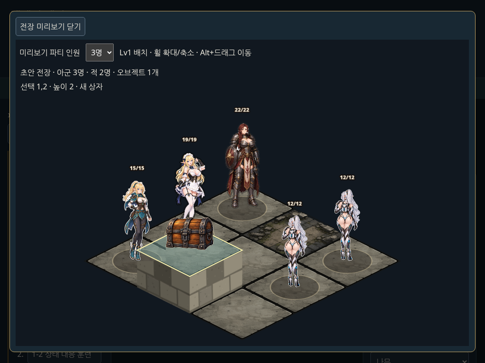
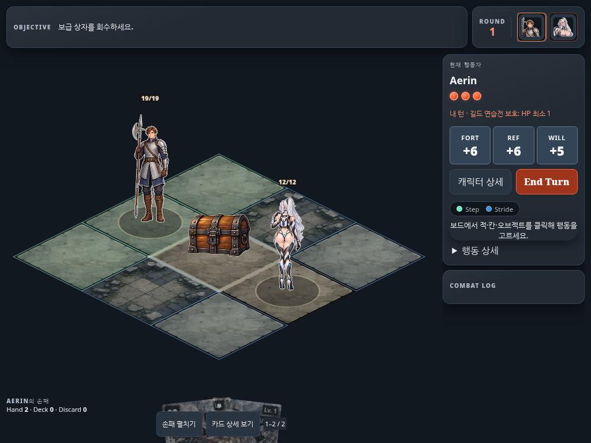
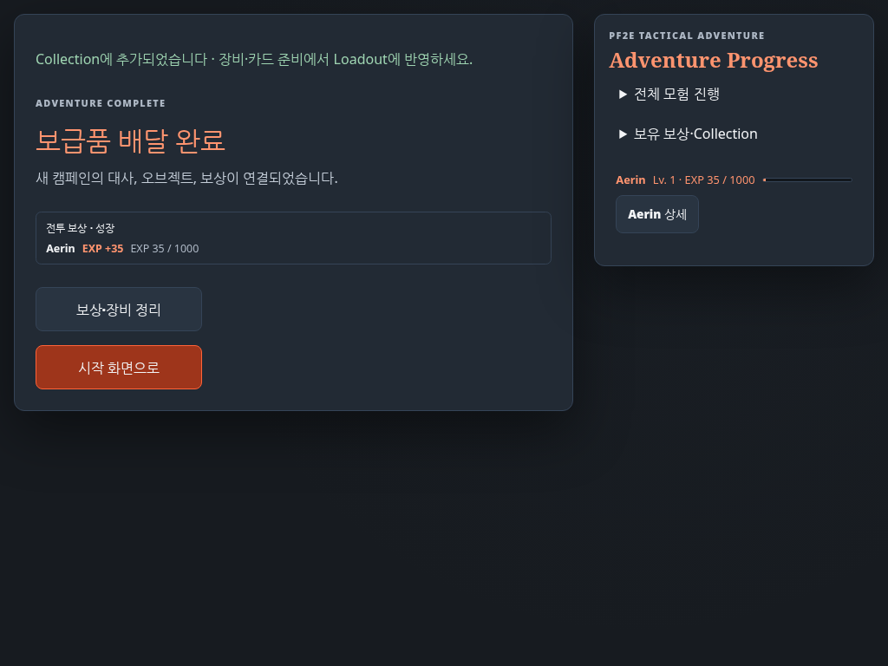

# 캠페인 제작 도구

목표: 맵·인카운터·다이얼로그·보상을 편집하고, Codex가 데이터와 에셋으로 새 오브젝트를 추가할 수 있게 한다. 실행 중인 캠페인/계정 DB를 수정하는 관리 도구가 아니라 저장소 콘텐츠를 제작하는 개발 도구다.

## 실행과 파일 반영

```sh
npm run dev:campaign
# http://127.0.0.1:4193/campaign-editor.html

npm run campaign -- export /tmp/my-campaign.json
npm run campaign -- check /tmp/my-campaign.json
npm run campaign -- plan /tmp/my-campaign.json
npm run campaign -- apply /tmp/my-campaign.json
CI=true npm run check && CI=true npm run test:all
```

`export`는 기존 파일을 덮어쓰지 않는다. `check`는 JSON 구조, 기존 게임 컴파일러의 콘텐츠 규칙, 대사·이미지·높이·오브젝트 참조를 검사한다. 실제 이미지 파일의 존재·규격은 기존 에셋 검사에서 확인한다. `plan`은 변경할 파일 목록만 출력한다. `apply`는 내보낸 시점의 `baseRevision`을 비교하여 오래된 편집본을 거부하고, 검증이 끝난 파일 집합만 반영한다. 다른 작성자의 lock을 제거하지 않는다. 반영 도중 I/O 오류가 나면 이미 쓴 파일을 복원하며 외부 동시 변경은 덮어쓰지 않는다.

맵의 배포 타일맵도 같은 반영 작업에서 갱신한다. `tools/assets/build-assets.ts`와 CLI가 `src/presentation/build-tilemaps.ts`를 공유하므로 맵만 편집할 때 전체 이미지 아틀라스를 다시 만들 필요가 없다. 새로운 **이미지 원본**을 추가한 경우에는 먼저 `npm run assets:build`로 이미지·manifest를 생성해야 한다.

현재 UI 기능:

- 맵: 좌표 그리드·키보드 선택, 지면·통행 속성, 높이 0~8, 크기 변경, 오브젝트 배치. 크기 변경은 좌표별 높이를 보존하며 배치된 엔티티/연결 타일이 잘리는 변경을 거부한다.
- 인카운터: 이름·목표, 적 정의·좌표·방향·등장 인원, 1~3번 파티 시작 위치, 전멸 또는 지정 목표의 AND 승리 조건. 고급 JSON에서 추가 rules와 오브젝트를 편집할 수 있다.
- 새 캠페인: 선택한 캠페인을 새 ID로 복제한다. 각 인카운터·타일·보상·출발 대사 ID와 참조를 새로 연결하고 높이·배경·장식을 복사하므로 원본과 독립적으로 편집할 수 있다. 생성 후 자동으로 새 캠페인을 선택하며 실행 취소가 가능하다. 생성만으로 기본 실행 캠페인은 바뀌지 않는다. **이 캠페인을 기본 실행으로 지정**을 누르면 초안의 기본 캠페인이 바뀐다. JSON 내보내기 → CLI plan/apply → 검사와 빌드를 거쳐 실행된다.
- 전장 미리보기: 편집 초안으로 실제 `BattleView`를 렌더링한다. 높이·지면·장식·새 오브젝트 이미지를 확인하고 타일을 클릭하면 좌표와 높이를 표시한다. 1~3명 선택은 실제 `buildAdventureEncounter`의 배치 조건을 사용한다. 인카운터의 인원 제한 밖 선택은 비활성화한다.
- 캠페인별 연결·진행 순서: 선택한 캠페인 이름 아래에서 인카운터 연결과 순서를 관리한다. 편집 드롭다운에는 해당 캠페인의 인카운터만 진행 순서대로 표시하며, 본문에 캠페인 → 단계·전장 경로를 표시한다. 캠페인 전환·JSON 불러오기·초안 복원·실행 취소 후에도 선택은 해당 캠페인 안에 유지된다. 위·아래 이동은 선택한 캠페인의 순서만 바꾼다.
- 인카운터 연결: 현재 전장을 복제하거나, 아직 어느 캠페인에도 속하지 않은 전장을 선택해 해당 캠페인의 마지막 단계에 연결한다. 새 연결의 경험치는 0으로 시작하며 보상 탭에서 설정한다. 복제 시 높이·배경·장식과 출발 대사도 함께 복제한다. 캠페인 설정에서 이름·소개·엔딩을 편집한다.
- 다이얼로그: 해당 전장의 출발 대사 생성, 화자·표정·본문, 대사 추가·삭제, 실제 ScenePlayer 재생. 전체 프로젝트 JSON으로 길드 안내 등 다른 대사와 binding도 편집할 수 있다.
- 보상: 경험치와 장비·카드·동료 선택 보상. 선택 항목 추가와 전체 보상 JSON 편집.
- 오브젝트: ID·이름·이미지·동작으로 템플릿과 Trait를 함께 추가한 뒤 맵에 배치.
- 보관: JSON import/export, 브라우저 초안 저장·복원, 최근 30회 실행 취소/다시 실행. 검증 실패 시 입력과 이전 유효 초안을 유지한다. 게임의 로그인·세션 저장 키와 분리되어 있다.

### 전장 미리보기 범위

미리보기는 편집기 안의 별도 프레임에서 실행한다. 닫으면 캔버스와 해당 실행 환경을 제거하고, 다시 열면 최신 초안을 읽는다. Lv1 기본 파티의 **배치 확인**이며 캠페인 진행에 따른 모집·레벨·장비 변화나 전투 플레이를 시뮬레이션하지 않는다. 현재 저장된 파티/진행 상황을 읽거나 변경하지 않는다.



## 파일 계약

프로젝트 구조는 `content/schema/campaign-project.schema.json`의 v1이다. `content`는 게임의 `ContentPackSource` 그대로이며 별도의 전투 규칙을 정의하지 않는다. `baseRevision`은 수정하지 않는다. 버전 업그레이드/migration은 아직 제공하지 않는다.

| 프로젝트 항목 | 반영 파일 |
| --- | --- |
| `content` | `content/m7/*.json`의 기존 카테고리 파일 |
| `activeAdventureId`, `authoredAdventureIds` | `content/m7/campaign.json` |
| `dialogue.scenes`, `dialogue.bindings` | `src/scene/campaign-dialogue.json` |
| `presentation.elevations`, `backgrounds`, `objects` | `presentation/m3/terrain-elevations.json`, `encounter-backgrounds.json`, `campaign-objects.json` |
| `presentation.scenery` | `art/source/generation-plan.json`의 `presentation.scenery` |
| 맵에서 파생한 배포 데이터 | `presentation/m3/tilemaps.json` |

현재 게임은 `activeAdventureId`로 선택한 캠페인을 읽는다. 새 캠페인 생성/실행 지정은 `authoredAdventureIds`에도 명시적으로 등록한다. Codex가 전체 JSON에서 캠페인을 추가할 때도 이 배열에 ID를 넣어야 한다.

출시 검사는 윌로우브룩의 기존 튜토리얼 순서·도달 가능한 콘텐츠 최소량·레벨 기준을 보호하면서 등록한 캠페인도 허용한다. 새 캠페인에는 자신의 인원 범위에 맞는 실제 전투 구성, 경험치, 보상 사용 가능성, AI와 이미지 참조를 검사한다. 윌로우브룩 전용 튜토리얼 순서나 전투 수를 다른 캠페인에 강제하지 않는다. 기존 reserve 목록은 보호 캠페인에서의 미사용 상태를 기록하고, 전체 고아 콘텐츠 판정에는 등록한 캠페인의 경로도 포함한다.

`apply`는 구조/콘텐츠/표현 참조의 유효성과 저장소 revision을 확인한다. 출시 기준 통과는 뒤이은 `npm run check`가 확인한다. 현재 출시 스토리 전용 Journey는 기본 캠페인의 실제 변경 시 새 스토리에 맞게 검토해야 한다. 새 데이터가 담긴 빌드에서 기존 저장 데이터를 이어 쓸 수 있는지는 게임의 저장/콘텐츠 호환성 계약에 따른다. 편집기는 기존 DB나 세이브를 변환하거나 삭제하지 않는다.

## Codex의 추가 오브젝트 절차

새 오브젝트를 만들 때 렌더러에 이름별 분기를 추가하지 않는다.

1. 프로젝트 `content.traits`에 고유한 terrain Trait를 정의한다. UI의 오브젝트 추가는 이 단계를 자동 수행한다.
2. `presentation.objects`에 동일한 ID, 한국어 이름, 등록된 `kind: object` 이미지 ID, 지원하는 interaction을 추가한다.
3. UI에서 배치하거나 `placeCampaignObject`로 배치한다. 파괴 오브젝트는 같은 칸에 `blocked`·`obstacle`을 붙이고 `targetTileId`를 정확히 연결한다. 레버는 실제 닫힌 성문 타일을 지정한다.
4. 새 이미지가 필요하면 `art/source/generation-plan.json`에 기존 `grounded-object` 형식의 원본·프레임을 추가하고 `npm run assets:build`를 실행한다. 생성된 이미지 ID를 템플릿 `visual`에 지정한다. 별도 오브젝트 이미지 URL을 임의로 런타임에 주입하지 않는다.
5. 프로젝트 check → plan → apply, 영향받는 검증과 최종 전체 gate를 수행한다.

기존 상자 이미지를 재사용하는 템플릿 예:

```json
{ "id": "supply-crate", "name": "보급 상자", "visual": "object.chest", "interaction": "destroy-obstacle" }
```

지원하는 동작은 현재 게임의 `destroy-obstacle`, `open-gate`다. 새로운 전투 동작은 GameCore의 Rule Extension을 먼저 구현해야 한다. 임의 JavaScript 실행이나 UI에서 별도 게임 규칙 계산은 허용하지 않는다.

## 검증 증거와 범위

| 요구사항 | 구현과 검증 |
| --- | --- |
| 맵 | 타일/높이/크기/오브젝트 편집, JSON 왕복, 위치 보존: `tests/domain/campaign-authoring.test.ts`, `tests/interaction/campaign-authoring.spec.ts` |
| 인카운터 | 적/방향/인원 조건/시작 위치/승리 목표, 전장 복제 및 순서: 같은 Domain·Interaction 파일 |
| 다이얼로그 | 화자/표정/본문/줄 추가·삭제, ScenePlayer 미리보기, 실제 게임의 출발 대사: Interaction 및 아래 J-AUTHOR |
| 보상 | 장비/카드/동료 정의와 경험치 편집, native 콘텐츠 검증, 실제 승리 경험치와 카드 획득: Interaction 및 J-AUTHOR |
| Codex 추가 오브젝트 | Trait·템플릿 등록, 이미지 선택, 실제 파괴·행동 소비·통행 해제: Domain 및 J-AUTHOR. 추가 동작은 별도의 Rule Extension 필요 |
| 새 캠페인과 실행 선택 | 맵·대사·보상 참조의 독립 복제, 기본 선택 UI/JSON, 보호 캠페인 계약 보존: Domain·Interaction, `tests/integration/contracts/campaign-release.test.ts` |
| 파일 반영 | no-op 바이트 보존, plan/apply, stale/다른 lock 거부, 반영 실패 복구, 배포 타일맵 동시 생성: `tests/integration/contracts/campaign-authoring.test.ts` |
| 실제 초안 전장 | BattleView의 높이 선택·새 이미지·인원 변경·재열기: Interaction, 1024×768 Chromium |
| 편집 결과의 실제 실행 | `tests/journeys/campaign-authoring.spec.ts` (J-AUTHOR, seed 60): 임시 저장소에 apply → 별도 production build/서버/DB → 새 대사 → 커스텀 상자 파괴 승리 → EXP 35 → 카드 보상 획득 → 작성한 엔딩. 성공/실패 모두 정리 |




전장 미리보기는 Lv1 배치 검사이며 전투 플레이 테스트를 대신하지 않는다. 자동 브라우저 검사는 1024×768 Chromium 기준이고 실제 iPad 검증을 의미하지 않는다. 최종 로컬 gate는 `CI=true npm run check && CI=true npm run test:all`이며 GitHub CI 결과와 구분한다.

2026-10-03 최종 로컬 gate: `check`와 `test:all`이 한 번의 연속 실행에서 종료 코드 0으로 완료되었다. Domain 169 + Integration 33 + Interaction 83 + Journey 5 = **290 passed**, 실패/skip/retry 없음. 실행 환경은 Node 24.18.1, npm 11.16.0, Linux Chromium이다. 이후 변경은 문서와 실행에서 수집한 이미지뿐이다. 이 후속 변경의 GitHub CI와 실제 iPad 검증은 실행하지 않았다.
