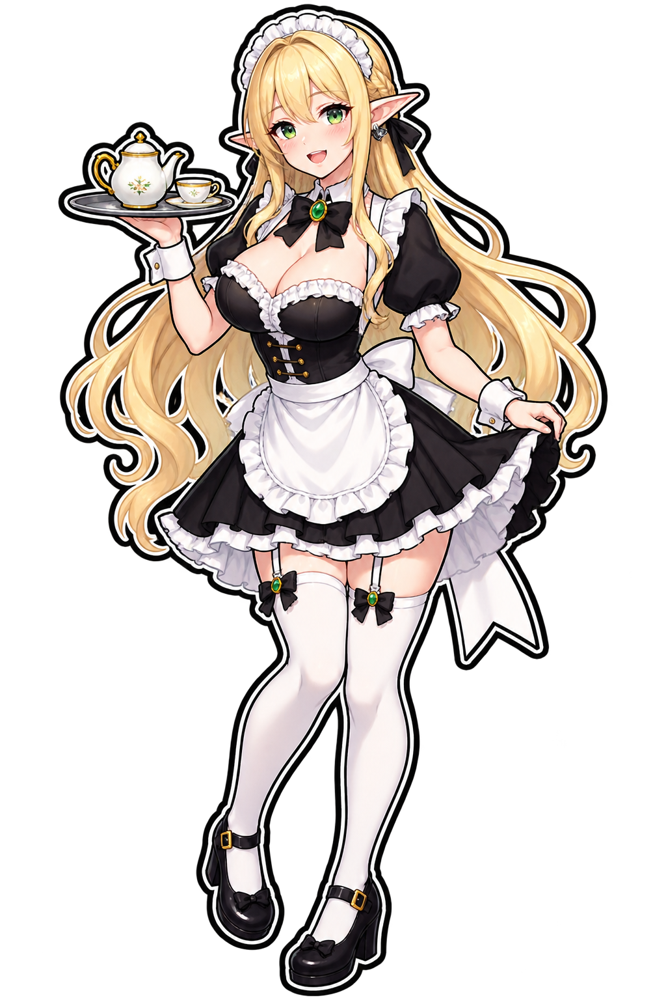

# ImageGen 투명 캐릭터 스탠디 검증 결과

## 결론

문서에 적힌 프롬프트를 수정하지 않고 `imagegen`에 그대로 입력해 투명
배경의 캐릭터 스탠디를 생성할 수 있음을 확인했다.

## 입력

- 원본 문서: `documents/ImageGen_Prompt.md`
- 사용 모드: `imagegen` 기본 내장 생성 모드
- 참조 이미지 입력: 없음
- 프롬프트 보강 또는 수정: 없음

실제 입력한 프롬프트:

```text
2d 엘프메이드  Character Standee. 2:3ratio 굵은 외곽선과 투명배경.
```

## 생성 결과



- 파일: `assets/characters/elf-maid-standee-prompt-verbatim.png`
- 형식: PNG, RGBA
- 크기: 1024 × 1536 px
- 화면 비율: 2:3

## 검증 결과

| 항목 | 결과 | 근거 |
| --- | --- | --- |
| 2D 엘프 메이드 | 통과 | 엘프 귀와 메이드 복장의 단일 캐릭터가 생성됨 |
| Character Standee | 통과 | 전신 중심 구도와 독립된 외곽 실루엣 |
| 2:3 비율 | 통과 | 1024 × 1536 px, 비율 0.666667 |
| 굵은 외곽선 | 통과 | 캐릭터 전체에 굵은 흑백 외곽선이 표현됨 |
| 투명 배경 | 통과 | RGBA 알파 범위 0–254, 완전 투명 픽셀 885,772개 |

전체 픽셀 중 완전 투명 픽셀 비율은 56.3159%다. 따라서 화면에 보이는
검정 영역은 투명 이미지를 표시하는 뷰어의 배경이며 PNG 자체에 합성된
검정 배경이 아니다.

## 관찰 사항

짧은 원문 프롬프트만 사용했기 때문에 포즈, 의상 세부 장식, 색상, 찻잔과
트레이 같은 소품은 생성 모델이 자율적으로 결정했다. 이런 세부 결과는
재생성할 때 달라질 수 있지만, 이번 검증의 명시 조건인 캐릭터 유형,
스탠디 형태, 2:3 비율, 굵은 외곽선, 투명 배경은 충족했다.
